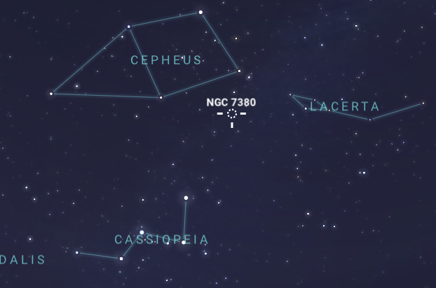

# Shooting and processing the Wizard Nebula (NGC 7380)

## Gear

### Hardware

 - EQ3-2 motorized mount
 - SkyWatcher Black Diamond NEQ3 150/750 newtonian
 - Orion SSAG camera + 50mm guidescope
 - Nikon D5600 astromodified camera + AC to Nikon EN-EL14A adapter
 - Motorized focuser
 - Laptop for guiding and data aquisition

### Software

 - Astrophotography Tool - free edition - [[https://www.astrophotography.app/]] 
 - Polar Finder mobile app - [[https://play.google.com/store/apps/details?id=com.techhead.polarfinder&hl=en]] (costs ~1USD but is very useful for a better polar alignment)
 - PHD 2 - [[https://openphdguiding.org/]] (get the latest version as it enables multi star guiding which increases accuracy)
 - Deep Sky Stacker - [[http://deepskystacker.free.fr/english/index.html]]
 - Photoshop CC 2021
   - Astronomy Tools Action Set - [[https://www.prodigitalsoftware.com/AstronomyToolsActions.html]]
 - Starnet++ 

## Setup

I went outside to install my telescope and collimate at about 21:00. The sun was slowly setting, making it a bit hard to align my secondary mirror. After that, collimation was a breeze as I am using a laser collimator.

I connected all my gear, then waited for nightfall.

When the Big Dipper started being visible I polar aligned my scope and used my finderscope to point it in the rough neightborhood of the nebula. I used Delta Cephei and Zeta Cephei as visible guides (they create a bright triangle with one of the tips pointing towards the Nebula).

Afterwards I used plate solving to center my scope on the target. I changed the finder scope to the guiding one and set up PHD 2. Its calibration process moved the target a bit, and I repositioned it, taking into account the fact that the edges of my field look a bit weird due to the lack of a flattener.

## Data acquisition

Captured frames:

 - Lights: 124 * 60s @ ISO 800
 - Darks: 42 * 60s @ ISO 800
 - Bias: 100 * 1/4000s @ ISO 800
 - Flats: 50 * 1/1000s @ ISO 800 (using the daytime sky and a white blanket; not the best method but I didn't have any other choices unfortunately)

I planned to capture more lights but unfortunately my telescope got stuck when touching my mount, and I decided to call it a night.

## Data processing

