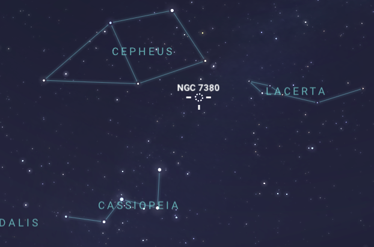
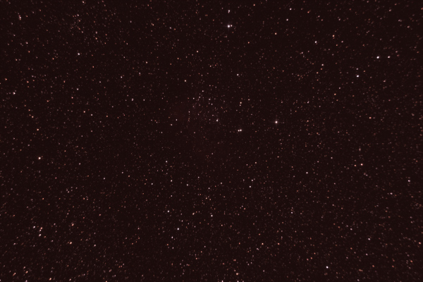
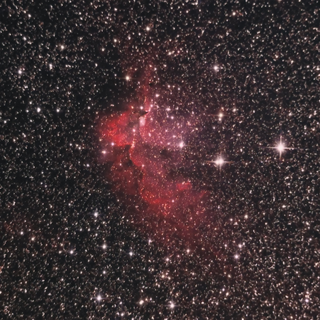

# Shooting and processing the Wizard Nebula (NGC 7380)

## Gear

### Hardware

 - EQ3-2 motorized mount
 - SkyWatcher Black Diamond NEQ3 150/750 newtonian
 - Orion SSAG camera + 50mm guidescope
 - Nikon D5600 astromodified camera + AC to Nikon EN-EL14A adapter
 - Motorized focuser
 - Laptop for guiding and data aquisition

### Software

 - Astrophotography Tool - free edition - [[https://www.astrophotography.app/]] 
 - Polar Finder mobile app - [[https://play.google.com/store/apps/details?id=com.techhead.polarfinder&hl=en]] (costs ~1USD but is very useful for a better polar alignment)
 - PHD 2 - [[https://openphdguiding.org/]] (get the latest version as it enables multi star guiding which increases accuracy)
 - Deep Sky Stacker - [[http://deepskystacker.free.fr/english/index.html]]
 - Photoshop CC 2021
   - Astronomy Tools Action Set - [[https://www.prodigitalsoftware.com/AstronomyToolsActions.html]]
 - Starnet++ 

## Setup

I went outside to install my telescope and collimate at about 21:00. The sun was slowly setting, making it a bit hard to align my secondary mirror. After that, collimation was a breeze as I am using a laser collimator.

I connected all my gear, then waited for nightfall.

When the Big Dipper started being visible I polar aligned my scope and used my finderscope to point it in the rough neightborhood of the nebula. I used Delta Cephei and Zeta Cephei as visible guides (they create a bright triangle with one of the tips pointing towards the Nebula).

Afterwards I used plate solving to center my scope on the target. I changed the finder scope to the guiding one and set up PHD 2. Its calibration process moved the target a bit, and I repositioned it, taking into account the fact that the edges of my field look a bit weird due to the lack of a flattener.

## Data acquisition

Captured frames:

 - Lights: 124 * 60s @ ISO 800
 - Darks: 42 * 60s @ ISO 800
 - Bias: 100 * 1/4000s @ ISO 800
 - Flats: 50 * 1/1000s @ ISO 800 (using the daytime sky and a white blanket; not the best method but I didn't have any other choices unfortunately)

I planned to capture more lights but unfortunately my telescope got stuck when touching my mount, and I decided to call it a night.

## Data processing

I used DeepSkyStacker with its recommended settings to stack all my frames. Below is the final result. The image looks quite red because of the absence of an IR cut filter for my camera. Another problem are the out of focus stars, this was caused by my camera being too far away from the focuser. 

However, considering the small amount of data (~1h) and short exposure times I think it turned out pretty well.

## Final Result

I followed AstroBackyard's processing tutorial - [[https://www.youtube.com/watch?v=5GgruZ-1zQ0]], and after a couple of hours of work I ended up with this beauty:

